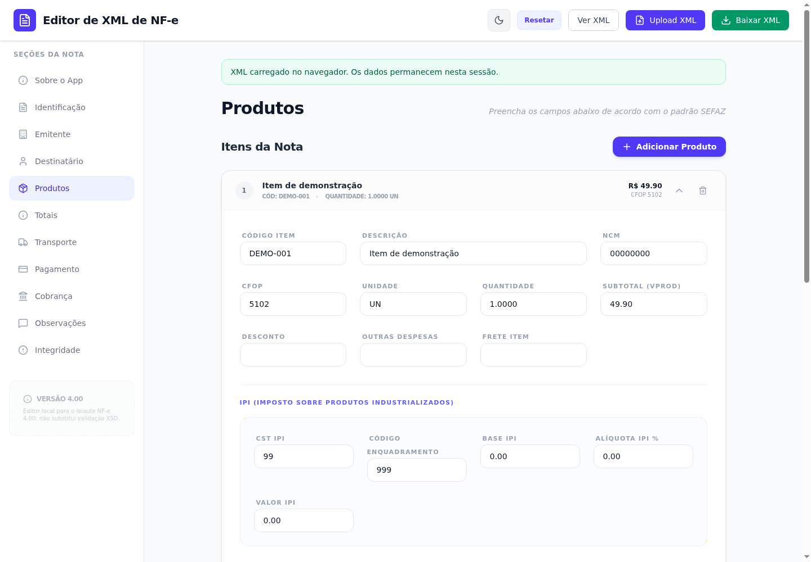

<div align="center">

# Editor de XML de NF-e

Edite e prepare arquivos XML de Nota Fiscal Eletrônica no navegador. Os dados do arquivo são processados localmente e não são enviados a uma API do projeto.

[](https://github.com/VIDORETTO/editor-xml-nfe-danfe/actions/workflows/ci.yml)

[Abrir o editor](https://editor-xml-nfe-danfe.vercel.app) · [Reportar um problema](https://github.com/VIDORETTO/editor-xml-nfe-danfe/issues)



</div>

## O que você pode fazer

- Abrir arquivos de NF-e no leiaute 4.00 e editar identificação, emitente, destinatário, produtos, totais, transporte, pagamento e observações.
- Corrigir pontuação de alguns campos e organizar os principais grupos de tags para exportação.
- Recalcular somatórios monetários auxiliares e baixar o XML resultante.
- Ver o XML gerado antes de baixá-lo.

## Como usar

1. Abra o [Editor de XML de NF-e](https://editor-xml-nfe-danfe.vercel.app) ou execute o projeto localmente.
2. Selecione **Upload XML** e escolha um arquivo de até 10 MB no leiaute NF-e 4.00.
3. Revise e edite os campos nas seções laterais. Variantes tributárias sem campos de edição ficam preservadas na estrutura do XML.
4. Se usar **Recalcular Totais Automático**, confira os valores e as regras do seu cenário fiscal.
5. Revise a aba **Ver XML** e escolha **Baixar XML**.

## Privacidade e limites

O editor lê o arquivo com `FileReader`, no navegador. O código do projeto não envia o XML a um servidor ou serviço externo. O aplicativo não exige chave de API nem configuração de segredo.

O editor não executa validação completa pelo esquema XSD, não consulta a SEFAZ e não assina nem autoriza notas. O recálculo é um auxílio aritmético; valide o arquivo em uma ferramenta fiscal antes de importá-lo. Ao editar um XML assinado, a assinatura original deixa de corresponder ao conteúdo.

---

# 🔧 Technical Documentation

## Stack

- React e TypeScript
- Vite
- Tailwind CSS
- `fast-xml-parser` para leitura, validação sintática e geração do XML

## Requisitos

- Node.js 22 (versão indicada em `.nvmrc` e exigida por `package.json`)
- npm incluído com Node.js

Não há variáveis de ambiente necessárias para desenvolvimento ou build.

## Desenvolvimento local

```bash
git clone https://github.com/VIDORETTO/editor-xml-nfe-danfe.git
cd editor-xml-nfe-danfe
npm ci
npm run dev
```

O Vite inicia o ambiente local em `http://localhost:3000`.

## Verificações e build

```bash
npm run typecheck
npm run build
npm run preview
```

`npm run build` gera o site estático em `dist/`. O workflow de CI executa a instalação reproduzível, a verificação TypeScript e o build em pushes para `main` e pull requests.

## Publicação

O repositório está conectado ao projeto de produção no Vercel: commits em `main` são publicados pela integração configurada. `vercel.json` encaminha as rotas para `index.html`, e o site está disponível em [editor-xml-nfe-danfe.vercel.app](https://editor-xml-nfe-danfe.vercel.app).

## Estrutura do projeto

| Caminho | Responsabilidade |
| --- | --- |
| `src/components/NFeEditor.tsx` | Formulário, leitura e geração do XML |
| `src/lib/nfe-money.ts` | Somatórios monetários auxiliares com centavos inteiros |
| `src/types/nfe.ts` | Tipos do documento e dos avisos de validação |
| `src/index.css` | Tailwind e estilos globais |
| `public/favicon.svg` | Ícone do aplicativo |
| `vercel.json` | Reescrita de rotas para o aplicativo |
| `.github/workflows/ci.yml` | Verificação TypeScript e build contínuos |

## Projeto e comunidade

Use [GitHub Issues](https://github.com/VIDORETTO/editor-xml-nfe-danfe/issues) para relatar problemas ou sugerir melhorias. Remova dados pessoais e fiscais de qualquer exemplo compartilhado.

Este repositório não contém um arquivo `LICENSE`; os termos de reutilização não estão definidos.
